# makers-bnb

## About this project
Makersbnb is a web-app similar to Airbnb and was built using Ruby and Sinatra. It allows users to: sign up and log in; view, create and book property listings; manage booking requests; and send messages between hosts and customers. This was a group project completed during week 5 of the Makers bootcamp.

## Learnings from this project
Through creating this app in a group environment, I improved my ability to:
- Work and communicate effectively within a software development team
- Break down projects into tasks and assign them to pairs
- Use agile ceremonies to organise work into sprints and improve processes
- Use a developer workflow to plan, implement and peer-review features
- Build fullstack web applications using Ruby and the Sinatra framework
- Create SQL databases and implement routes that interact with and manipulate data in these databases
- Implement user authentication using bcrypt
- Carry out unit and integrations tests with RSpec
- Use Embedded Ruby (ERB) to dynamically edit HTML view pages
- Style websites with CSS

## Installation
### How to install the code
- Clone this repository to your local machine:
``git clone git@github.com:atcq9876/makers-bnb.git``
- Navigate into the project directory:
``cd makers-bnb``
- Install the necessary dependencies:
``bundle install``

### How to set up the databases
- Install PostgreSQL database (if necessary)
- Create a development database:
``createdb makers_bnb_development``
- Create a test database:
``createdb makers_bnb_test``
- Set up the tables in the development database:
``psql -h 127.0.0.1 makers_bnb_development < tables.sql``
- Set up the tables in the test database:
``psql -h 127.0.0.1 makers_bnb_test < tables.sql``
- Set up the seeds in the test database:
``psql -h 127.0.0.1 makers_bnb_test < /spec/seeds.sql``

### How to run the code
- Navigate into the project directory:
``cd makers-bnb``
- Run rackup:
``rackup``
- Open your web browser and go to http://localhost:9292/
- You can then explore the website. Please note that you will need to sign up and log in to gain full access.

### How to run the tests
- Navigate into the project directory:
``cd makers-bnb``
- Run the tests:
``rspec``

## Screenshots
- Login page
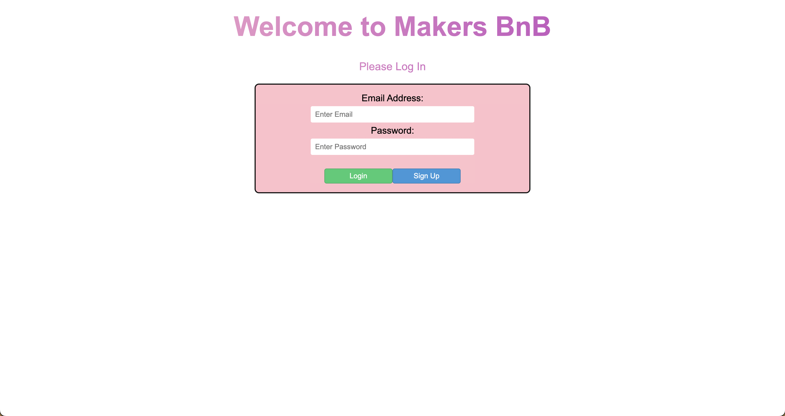
- Signup page
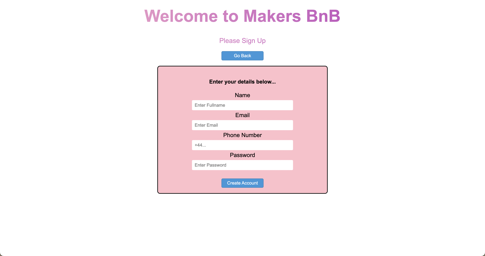
- Logged in home page
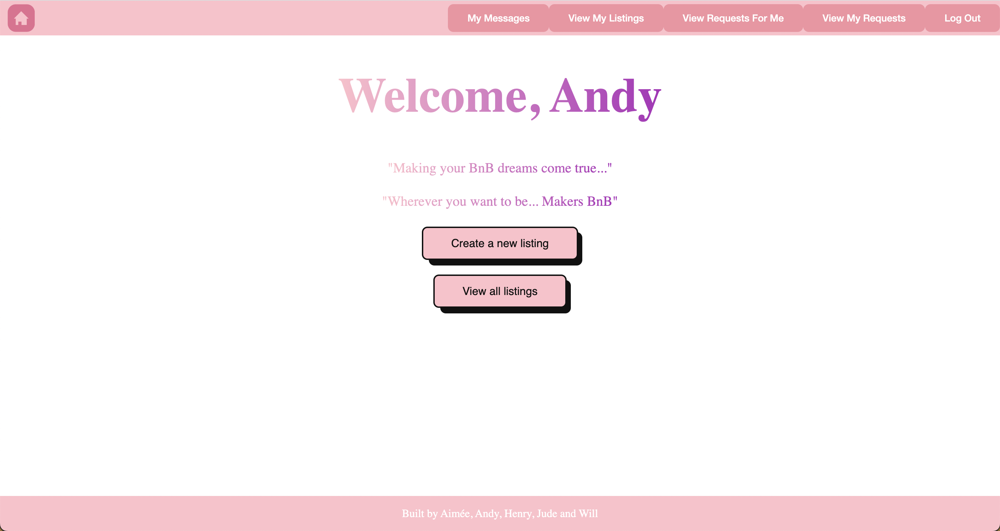
- View all listings
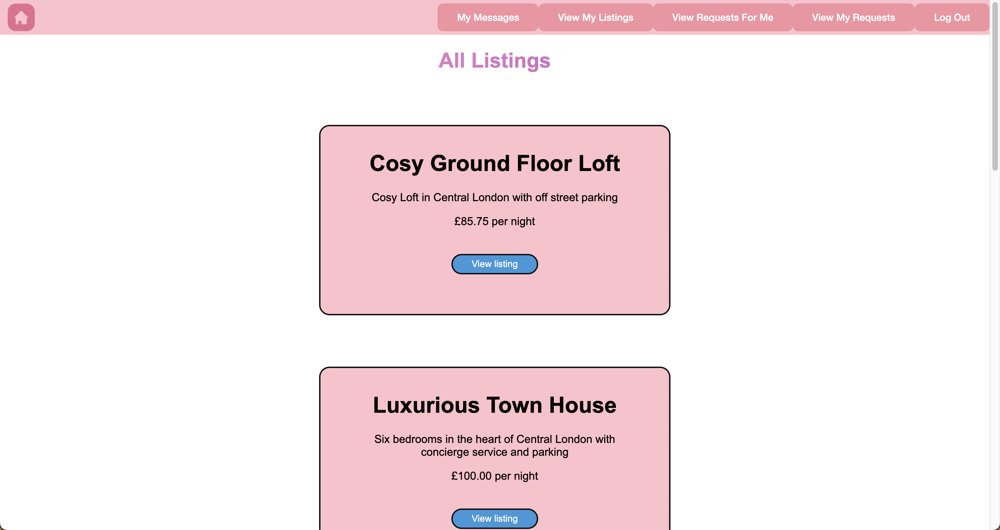
- View an individual listing
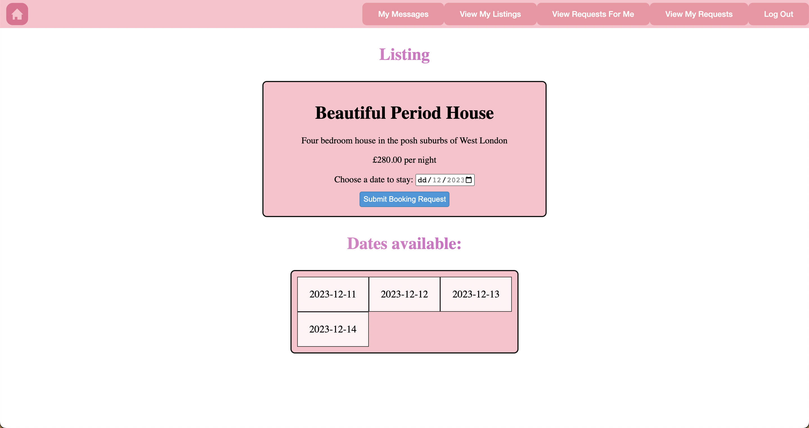
- Create a listing
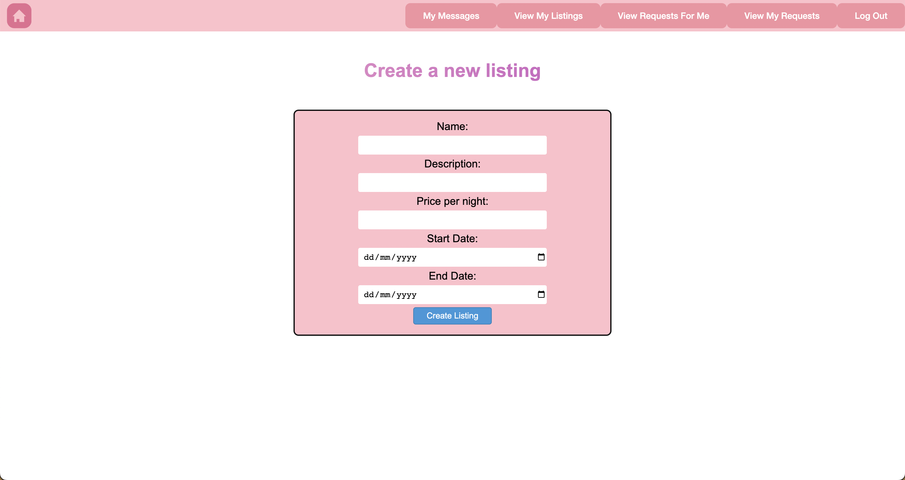
- View my listings
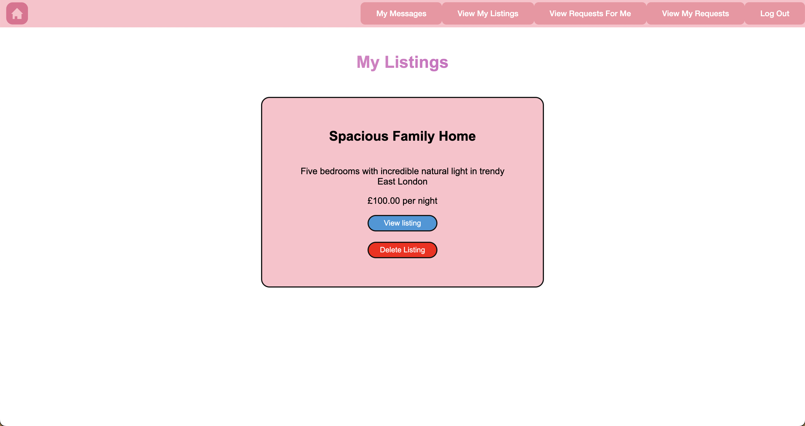
- Requests for me
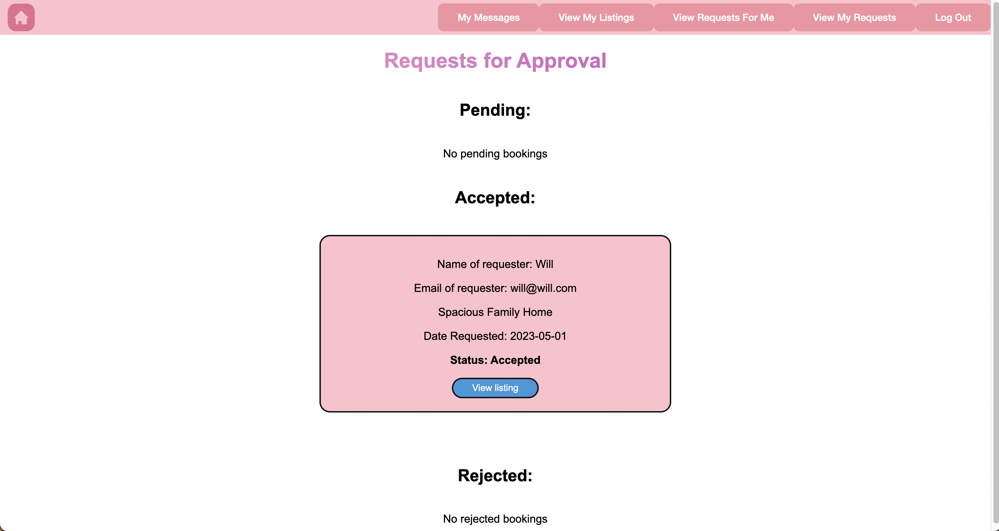
- Requests made by me
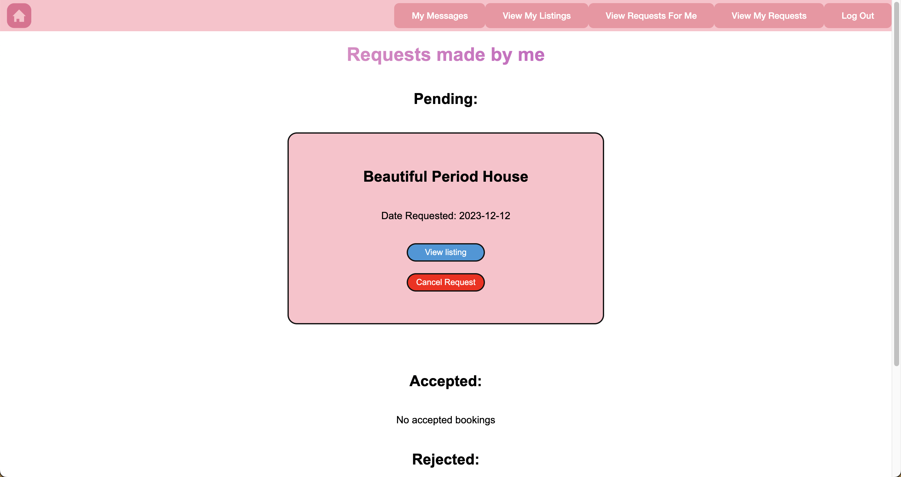
- Messaging between a host and customer
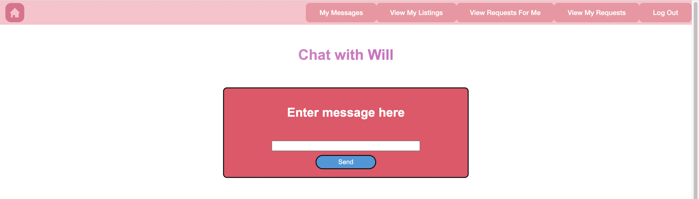
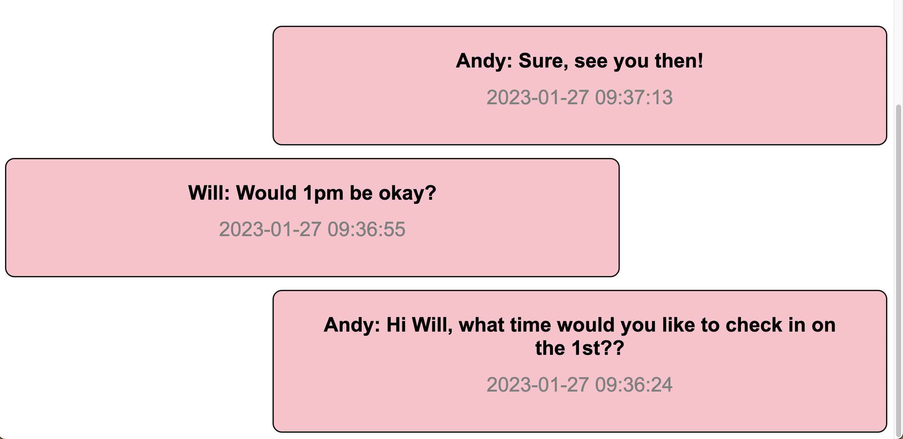
- All 46 tests passing

